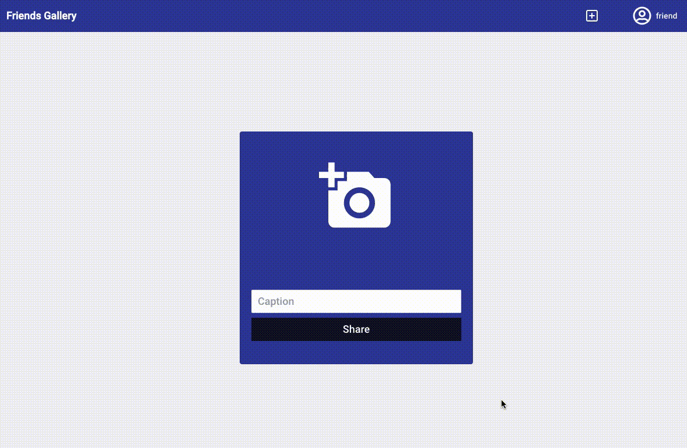
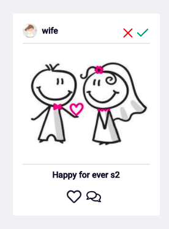
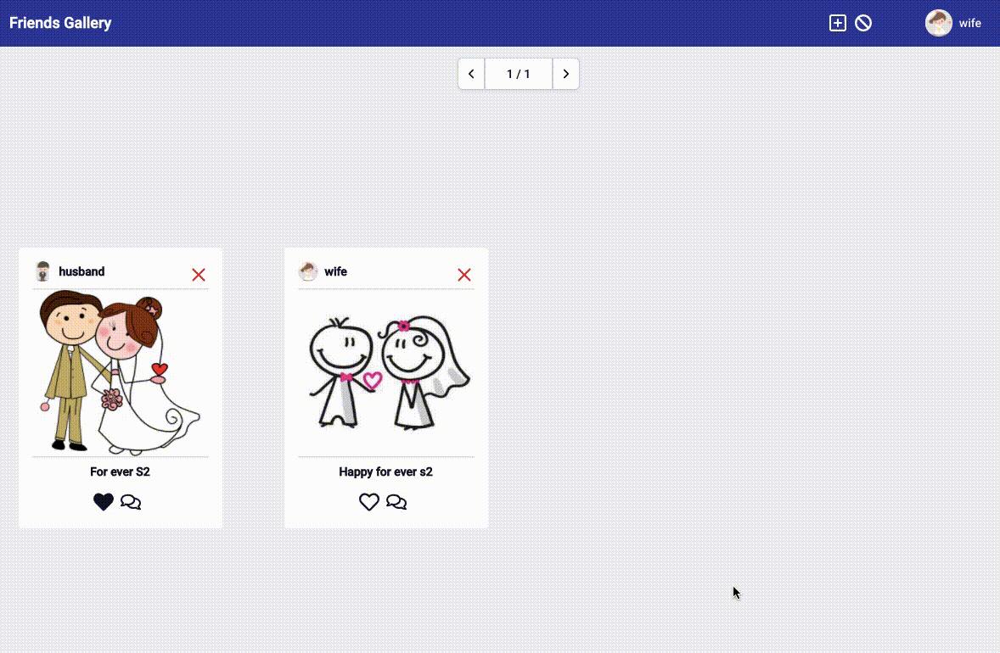

# Friends Gallery

It is the frontend for the app Friends Gallery, system when married friends will post photographs to celebrate this moment. 

The married users have permissions to approve the posts. They are created by [Django admin](https://gallery.api.devsenior.xyz/admin/), and the others users are posted your register at the [Sign Up page](https://gallery.devsenior.xyz/signup/).

For access the System, [click here](https://gallery.devsenior.xyz/signup/) and sign up with your data or [click here](https://gallery.devsenior.xyz/) and sign in with some credentials below:

* Django Admin
    * Email: admin@admin.com
    * Password: admin2021

* Husband
    * Email: husband@husband.com
    * Password: husband2021

* Wife
    * Email: wife@wife.com
    * Password: wife2021

* Friend
    * Email: friend@friend.com
    * Password: friend2021


## Technologies

* React JS
* Tailwind
* Javascript
* Deploy at Firebase

## Running the project

To run this app in your host, do you need to clone this repository and install the [Node](https://nodejs.org/en/download/). After this, you need just to install the dependencies and run your app. You can do it with the follow commands:

### Clone the repository

```bash
git clone https://github.com/mateus-oliveira/friends-gallery-web.git
cd friends-gallery-web/
```
### Configure the .env

In the [.env](./.env.example) file, define the REACT_APP_API_URL variable with the API base URL. In my case, I use the API at [https://gallery.api.devsenior.xyz](https://gallery.api.devsenior.xyz). Then write this:

```python
REACT_APP_API_URL=https://gallery.api.devsenior.xyz
```
### Start the app

```bash
yarn install
yarn start
```

That commands will open your browser automatically at [http://localhost:3000/](http://localhost:3000/), but if don't open, do it manually.

## Using the app

Now, do you can use the app normally. Below are the description about some functions to you can use.
### Post an image: [click here](https://gallery.devsenior.xyz/add-post)

For post an image, do you have to click in the plus button, they are at the right superior position and it is how that:


After this, the post form will appear, and do you can select the image and write the caption. After this, do you can share the post. See the example below:



All posts are created with the status "Pending", because the married users (husband or wife) have to validate. Then, logged how married, do you can see the blocked button side the plus button. It is how that image:


Then you can see the pending posts list, that list have many posts with cards how that:



The married users can approve or disapprove this post at the green or red button respectively.

### Comment and like a post

For like a post, do you have just click at the heart button under the image, and for comment, do you have to click at the image for open the modal  with all comments. See the examlpe:



### Other functions

The other app functions are:

* [Reset Password](https://gallery.devsenior.xyz/redefine-password/): to reset password when forget;
* [Sign Up](https://gallery.devsenior.xyz/signup/): to register a new user friend;
* [Profile](https://gallery.devsenior.xyz/profile/): to see the posts from an especified user. Do you have just change the username at the URL.